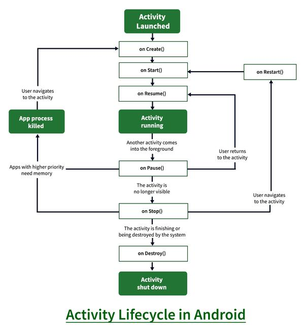
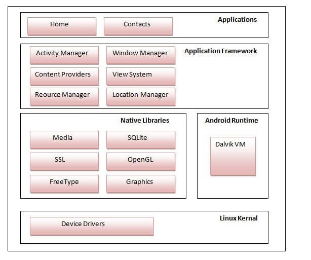

# Assignment 1

## <mark> 1) Explain Android and its features. </mark>

**Android** is a mobile operating system based on the Linux kernel and primarily designed for touchscreen mobile devices such as smartphones and tablets. It is developed and maintained by Google.

**Key Features of Android:**

1. **Open-Source Nature:** Android is primarily open-source, meaning developers have the freedom to customize and modify the operating system to suit their specific needs. This has led to a vast ecosystem of devices and a thriving developer community.

2. **User Interface:** Android is known for its intuitive and user-friendly interface, featuring a home screen with customizable widgets, app icons, and a notification bar.

3. **Google Play Store:** The Google Play Store is the official app store for Android devices, offering millions of applications, games, books, movies, and more.

4. **Customization:** Android allows for extensive customization, enabling users to personalize their devices with different launchers, themes, and widgets.

5. **Connectivity:** Android supports various connectivity options, including Wi-Fi, Bluetooth, NFC, 4G/5G, and more, enabling seamless communication and data transfer.

6. **Hardware Integration:** Android seamlessly integrates with a wide range of hardware components, including cameras, GPS, accelerometers, and other sensors.

7. **Multitasking:** Android supports multitasking, allowing users to run multiple apps simultaneously and switch between them easily.

8. **Widgets:** Widgets are small app components that provide quick access to information and functionality directly on the home screen.

9. **Security:** Android has built-in security features such as a lock screen, encryption, and Google Play Protect to safeguard user data.

10. **Accessibility:** Android offers accessibility features to assist users with disabilities, such as screen readers, text-to-speech, and magnification.

**In essence, Android's open-source nature, user-friendly interface, vast app ecosystem, and extensive customization options have contributed to its widespread popularity and dominance in the mobile market.**

## <mark> 2) Explain history and list of Android Versions. </mark>

**History of Android**

Android's journey began in 2003 when Andy Rubin, Rich Miner, Chris White, and Nick Sears founded Android Inc. In 2005, Google acquired the company, recognizing the potential of mobile technology. The first beta version of Android was released in November 2007, and the first commercial version, Android 1.0, hit the market on September 23, 2008, powering the HTC Dream (also known as the T-Mobile G1).

Since then, Android has undergone continuous evolution, with new versions released regularly, each bringing significant improvements and innovations.

**List of Android Versions**

Here's a list of the major Android versions, along with their codenames and release years:

- **Android 1.0 - 1.1:** No codename (2008)
- **Android 1.5:** Cupcake (2009)
- **Android 1.6:** Donut (2009)
- **Android 2.0 - 2.1:** Eclair (2009)
- **Android 2.2:** Froyo (2010)
- **Android 2.3:** Gingerbread (2010)
- **Android 3.0 - 3.2:** Honeycomb (2011)
- **Android 4.0:** Ice Cream Sandwich (2011)
- **Android 4.1 - 4.3:** Jelly Bean (2012)
- **Android 4.4:** KitKat (2013)
- **Android 5.0 - 5.1:** Lollipop (2014)
- **Android 6.0:** Marshmallow (2015)
- **Android 7.0 - 7.1:** Nougat (2016)
- **Android 8.0 - 8.1:** Oreo (2017)
- **Android 9:** Pie (2018)
- **Android 10:** Android 10 (2019)
- **Android 11:** Android 11 (2020)
- **Android 12:** Android 12 (2021)
- **Android 13:** Android 13 (2022)
- **Android 14:** Android 14 (2023)
- **Android 15:** Android 15 (2024)

Each new version introduces a range of enhancements, including improved performance, new features, enhanced security, and a refined user interface.

## <mark> 3) Explain types of widgets. </mark>

**Types of Android Widgets**

Android widgets are small, interactive elements that can be placed on your home screen to provide quick access to information and functionality. Here's a breakdown of some common types:

**1. Information Widgets:**

- **Display Data:** These widgets primarily show information from an app.
  - **Examples:** Weather widget (temperature, forecast), Calendar widget (upcoming events), News widget (headlines), Clock widget (time, date).

**2. Control Widgets:**

- **Trigger Actions:** These widgets allow you to control app functions directly from the home screen.
  - **Examples:** Music player widget (play, pause, skip tracks), Settings widget (Wi-Fi, Bluetooth toggles), Smart home device widget (control lights, thermostat).

**3. Collection Widgets:**

- **Show Multiple Items:** These widgets present a collection of items from an app.
  - **Examples:** Photo gallery widget (display thumbnails), Contact list widget (quick access to contacts).

**4. Hybrid Widgets:**

- **Combine Features:** These widgets blend information and control elements.
  - **Examples:** Email widget (show unread emails and allow quick composition), Social media widget (display recent posts and enable posting).

**5. Custom Widgets:**

- **Unique Functionality:** Developers can create custom widgets with specific functionalities tailored to their apps.
  - **Examples:** Games with interactive elements on the home screen, specialized tools for productivity or creativity.

**Key Points:**

- **Variety:** The types of widgets available are constantly expanding as developers create innovative designs.
- **Customization:** Many widgets offer customization options, allowing you to personalize their appearance and behavior.
- **Convenience:** Widgets enhance the user experience by providing quick access to essential information and controls without needing to open the full app.

I hope this explanation is helpful! Let me know if you'd like to delve deeper into a specific type of widget or have any other questions.

## <mark> 4) Explain activity life cycle. </mark>

**Android Activity Lifecycle**

The Android Activity Lifecycle is a fundamental concept in Android development. It defines the various states that an Activity can go through during its lifetime, from creation to destruction. Understanding this lifecycle is crucial for writing efficient and well-behaved Android applications.

**Key States and Methods**

1. **onCreate()**:

   - Called when the activity is first created.
   - Use this method to initialize essential components like views, data, and settings.

2. **onStart()**:

   - Called when the activity is becoming visible to the user.
   - The activity is partially visible at this point.

3. **onResume()**:

   - Called when the activity will start interacting with the user.
   - The activity is at the top of the activity stack and is fully interactive.

4. **onPause()**:

   - Called when the activity is no longer visible to the user.
   - This usually happens when another activity is launched or a dialog covers the activity.

5. **onStop()**:

   - Called when the activity is no longer visible.
   - The activity may be killed at this point if the system needs resources.

6. **onRestart()**:

   - Called after onStop() when the activity is being re-shown to the user.

7. **onDestroy()**:
   - Called before the activity is destroyed.
   - This is the last call the activity will receive. Use this to release resources like threads, registered listeners, etc.

**Visual Representation**



**Why is it Important?**

- **Resource Management**: By understanding the lifecycle, you can manage resources efficiently. For example, you can release network connections or stop background tasks in onPause() to conserve battery.
- **User Experience**: Proper lifecycle management ensures a smooth and responsive user experience. For example, you can save the user's progress in onPause() so that it can be restored if the activity is killed.
- **Configuration Changes**: The lifecycle also handles configuration changes like screen rotation. By saving and restoring the activity's state, you can prevent data loss when the device orientation changes.

**Example**

```java
@Override
protected void onCreate(Bundle savedInstanceState) {
    super.onCreate(savedInstanceState);
    setContentView(R.layout.activity_main);

    // Initialize views and data here
}

@Override
protected void onPause() {
    super.onPause();
    // Save data or release resources here
}

@Override
protected void onResume() {
    super.onResume();
    // Update UI or start tasks here
}
```

By understanding and effectively using the Android Activity Lifecycle, you can create robust and user-friendly applications.

## <mark> 5) Explain architecture of Android. </mark>

**Android Architecture**

The Android operating system is built on a layered architecture, with each layer providing specific functionalities and interacting with the layers above and below it. This layered approach enhances modularity, maintainability, and flexibility.

**Key Layers:**

1. **Linux Kernel:**

   - The foundation of the Android platform.
   - Provides core operating system services like memory management, process management, security, and device drivers.

2. **Hardware Abstraction Layer (HAL):**

   - An interface between the Linux kernel and the underlying hardware (e.g., display, camera, sensors).
   - Allows device manufacturers to adapt the Android platform to different hardware configurations.

3. **Android Runtime:**

   - Executes Android applications.
   - Consists of the Dalvik Virtual Machine (DVM) or the newer Android Runtime (ART), which compiles and executes code efficiently.

4. **Native C/C++ Libraries:**

   - A collection of libraries written in C and C++ that provide essential functionalities like surface manager, media framework, SQLite database, and OpenGL ES.

5. **Java API Framework:**

   - A set of Java libraries that provide high-level services like content providers, view system, package manager, telephony, and location services.
   - Developers use these libraries to build Android applications.

6. **Applications:**
   - The top layer consists of user-installed applications like Google Maps, Gmail, and third-party apps.

**Visual Representation:**



**Key Points:**

- **Layered Approach:** The layered architecture promotes modularity and separation of concerns, making it easier to maintain and update the system.
- **Open Source:** The open-source nature of the Linux kernel and most of the other layers allows for customization and innovation by device manufacturers and developers.
- **Virtualization:** The use of a virtual machine (DVM or ART) provides isolation and security for applications, preventing them from interfering with each other or the underlying system.

By understanding the Android architecture, developers can build more efficient, robust, and secure applications that take full advantage of the platform's capabilities.

## <mark> 6) Explain intent with their types. </mark>

**Intents in Android**

In Android, an **Intent** is a messaging object that allows you to communicate between different components within your application or even with components in other applications. It's essentially a request to perform an action.

**Types of Intents:**

1. **Explicit Intents:**

   - **Explicitly specify the target component:** You explicitly name the target component (Activity, Service, Broadcast Receiver) in the Intent object.
   - **Used for:**
     - Launching activities within your own app.
     - Communicating between components within your app.
     - Example:
       ```java
       Intent intent = new Intent(this, MySecondActivity.class);
       startActivity(intent);
       ```

2. **Implicit Intents:**
   - **Do not specify a target component:** You define the action to be performed and optionally provide data or categories.
   - **Used for:**
     - Launching activities in other applications (e.g., viewing a map, sending an email).
     - Handling actions initiated by other applications.
   - **Example:**
     - **View a map:**
       ```java
       Intent intent = new Intent(Intent.ACTION_VIEW, Uri.parse("geo:37.7749,-122.4194"));
       startActivity(intent);
       ```
     - **Send an email:**
       ```java
       Intent intent = new Intent(Intent.ACTION_SEND);
       intent.setType("text/plain");
       intent.putExtra(Intent.EXTRA_EMAIL, new String[] {"recipient@example.com"});
       intent.putExtra(Intent.EXTRA_SUBJECT, "Subject");
       intent.putExtra(Intent.EXTRA_TEXT, "Body");
       startActivity(Intent.createChooser(intent, "Send Email"));
       ```

**Key Concepts**

- **Intent Filters:**
  - Components (Activities, Services, Broadcast Receivers) can declare intent filters in their manifest.
  - These filters specify the types of intents that a component can handle.
  - When you send an implicit intent, the system finds the most suitable component based on the intent filters.
- **Data:**
  - Intents can carry data associated with the action, such as URLs, strings, or file paths.
- **Extras:**
  - You can add extra information to an Intent using key-value pairs.

**In Summary:**

Intents are a powerful mechanism for inter-component communication in Android, enabling you to create flexible and modular applications that can interact with other applications on the device.

## <mark> 7) Explain view, views and layout. </mark>

**In Android, Views and Layouts are fundamental building blocks for creating user interfaces.**

**Views**

- **Basic Building Blocks:** Views are the individual UI elements that users interact with. They represent a rectangular area on the screen that can display content or respond to user input.
- **Examples:**
  - **TextView:** Displays text.
  - **Button:** A clickable button that triggers an action.
  - **EditText:** Allows users to input text.
  - **ImageView:** Displays images.
  - **CheckBox:** A toggleable option.
  - **RadioButton:** A selection option where only one can be selected at a time.

**Layouts**

- **Containers:** Layouts are invisible containers that organize and position Views on the screen. They define the structure and layout of the UI.
- **Types:**
  - **LinearLayout:** Arranges Views in a single direction (horizontal or vertical).
  - **RelativeLayout:** Positions Views relative to each other or the parent layout.
  - **ConstraintLayout:** A flexible and powerful layout that positions Views based on constraints between them.
  - **FrameLayout:** Stacks Views on top of each other.
  - **GridLayout:** Arranges Views in a grid.

**Relationship Between Views and Layouts**

- **Hierarchy:** Layouts can contain other Layouts and Views, creating a hierarchical structure.
- **Positioning:** Layouts determine the size, position, and alignment of the Views they contain.
- **Interaction:** Views within a Layout can interact with each other and respond to user input.

**Example:**

Imagine a simple login screen. You might have a `LinearLayout` as the root layout. Inside, you would place a `TextView` for the "Username" label, an `EditText` for the username input, another `TextView` for the "Password" label, an `EditText` for the password input, and finally a `Button` for the "Login" action.

**Key Points:**

- **Views** are the individual UI elements.
- **Layouts** are the containers that organize and position Views.
- Understanding the relationship between Views and Layouts is crucial for creating effective and user-friendly Android UIs.

I hope this explanation is helpful!

## <mark> 8) Explain XML, Java and android manifest file. </mark>

**1. XML (Extensible Markup Language)**

- **What it is:** XML is a markup language used to store and transport data. It's similar to HTML, but it's designed for data representation rather than displaying information on a web page.
- **Key Features:**
  - **Self-describing:** XML uses tags to define the structure and meaning of the data.
  - **Flexible:** You can create your own custom tags to suit your specific needs.
  - **Platform-independent:** XML data can be processed by various applications and platforms.
- **In Android:** XML is extensively used in Android development for:
  - **Defining layouts:** You use XML to create the structure of your app's user interface (UI) by defining how Views (like buttons, text fields, images) are arranged on the screen.
  - **Declaring resources:** You can define various resources like strings, colors, dimensions, and styles in XML files, making it easier to maintain and localize your app.

**2. Java**

- **What it is:** Java is a high-level, object-oriented programming language known for its platform independence ("write once, run anywhere").
- **Key Features:**
  - **Object-oriented:** Java is based on the concept of objects, which encapsulate data and behavior.
  - **Platform-independent:** Java code is compiled into bytecode, which can run on any platform with a Java Virtual Machine (JVM).
  - **Robust:** Java has strong type checking and built-in memory management features, which help prevent common programming errors.
- **In Android:** Java is the primary language for developing Android applications. It's used to:
  - **Write application logic:** You use Java to handle user interactions, perform calculations, access data, and control the flow of your app.
  - **Create custom Views:** You can create custom UI components by extending existing View classes and implementing custom drawing and behavior.
  - **Interact with the Android framework:** Java provides access to the Android APIs, allowing you to interact with various system components like sensors, location services, and the network.

**3. AndroidManifest.xml**

- **What it is:** The AndroidManifest.xml file is a crucial component of every Android application. It's an XML file that contains essential information about your app, such as:
  - **Package name:** A unique identifier for your app.
  - **Application components:** Declares the activities, services, broadcast receivers, and content providers that your app consists of.
  - **Permissions:** Specifies the permissions that your app requires to access certain features or data (e.g., camera, location, contacts).
  - **Hardware and software requirements:** Defines the minimum Android version and hardware features required to run your app.
  - **Application icon and theme:** Specifies the icon and theme that will be used for your app.
- **Importance:**
  - The Android system uses the information in the manifest file to install, run, and manage your app.
  - It's essential to correctly configure the manifest file to ensure your app functions as expected and complies with Android's guidelines.

**In Summary:**

- XML is used for defining UI layouts and resources.
- Java is the primary programming language for implementing application logic.
- The AndroidManifest.xml file provides essential metadata about your app to the Android system.

These three components work together to create a complete Android application.
