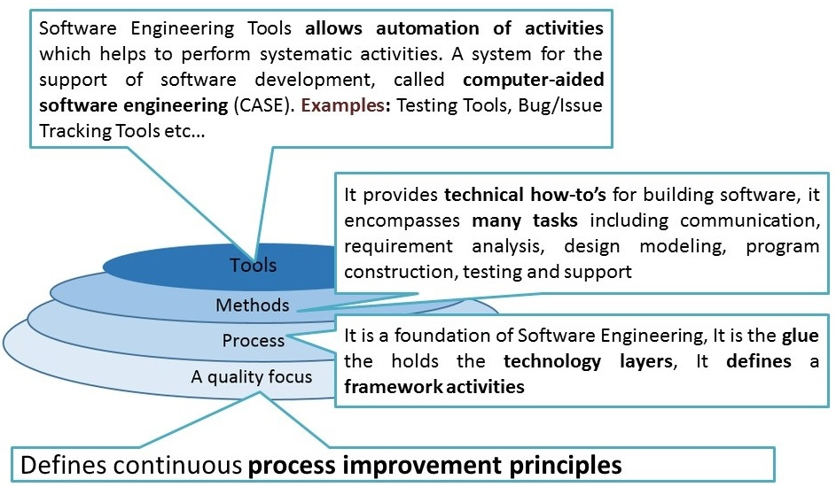
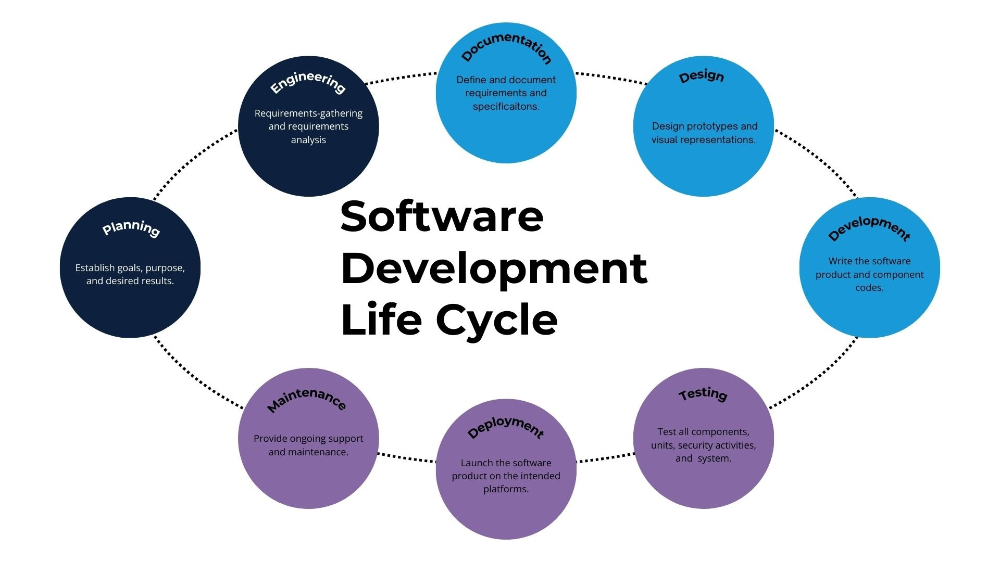
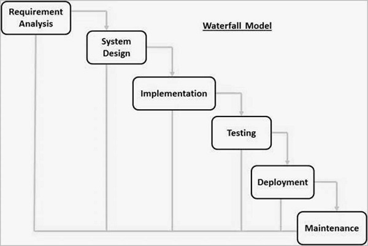
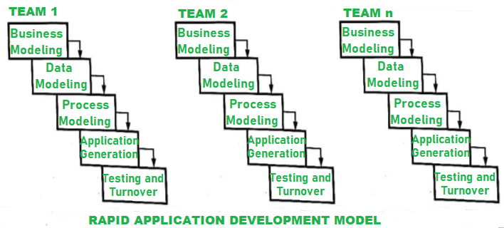
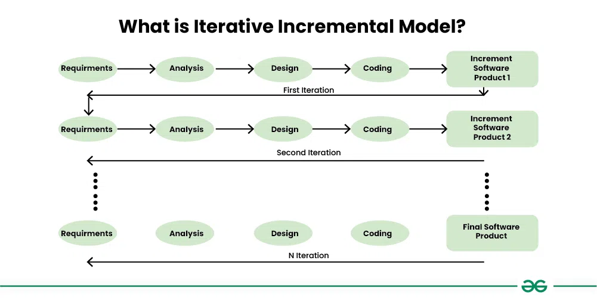
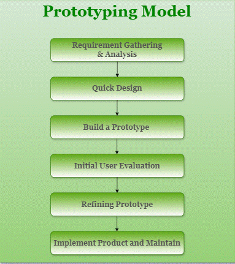
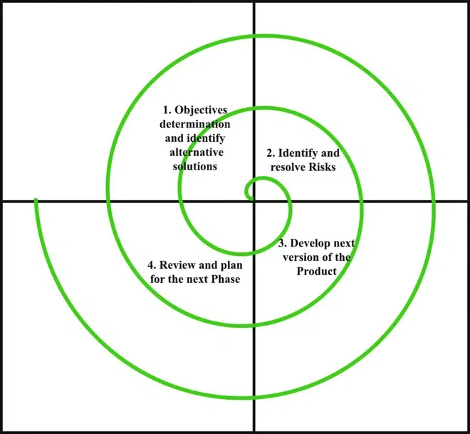
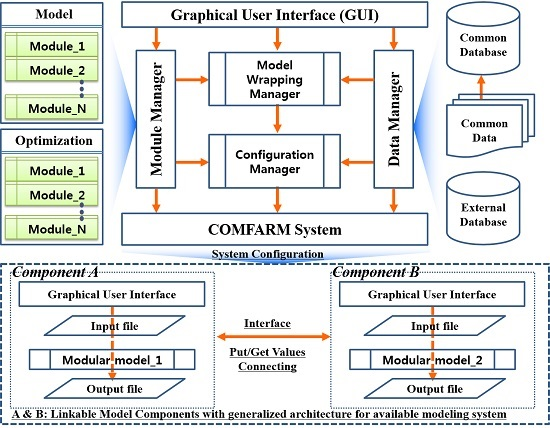
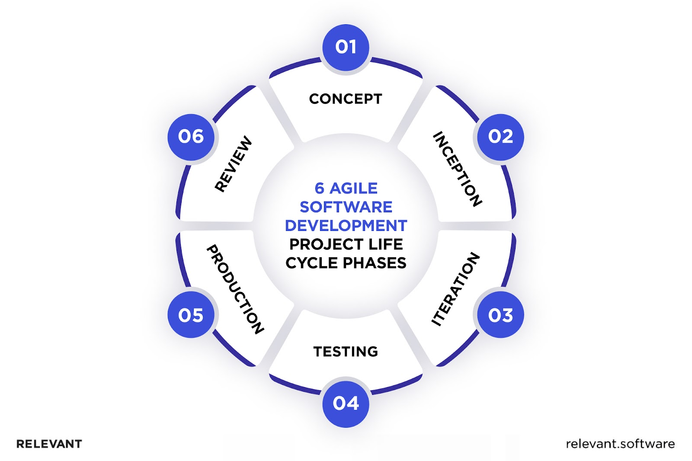

# Assignment 1

# 1) What is Software Engineering? Explain the Evolving role of software with software crisis on the horizon and software myths.

## Software Engineering, Evolving Role of Software, and Software Crisis

**Software Engineering** is a systematic and disciplined approach to designing, developing, testing, and maintaining software systems. It involves applying engineering principles, techniques, and tools to ensure the quality, reliability, and efficiency of software products.

### Evolving Role of Software

- **Ubiquity:** Software is increasingly pervasive in our lives, from smartphones and computers to automobiles, healthcare, and critical infrastructure.
- **Complexity:** Software systems are becoming more complex, with interconnected components and intricate functionalities.
- **Velocity:** The demand for new software and updates is constantly growing, requiring faster development cycles.

### Software Crisis

The software crisis refers to the challenges and difficulties faced in the development and maintenance of software systems. These challenges include:

- **Cost Overruns:** Software projects often exceed their budgeted costs due to unforeseen complexities and delays.
- **Schedule Slippages:** Projects frequently miss their deadlines, leading to disruptions and missed opportunities.
- **Poor Quality:** Software products may contain bugs, errors, or security vulnerabilities, impacting user experience and reliability.
- **Lack of Maintainability:** Software systems can become difficult to modify or update over time, hindering their adaptability.

### Software Myths

- **Myth:** "Adding more programmers to a late project will make it finish sooner."
- **Reality:** Adding more programmers can increase communication overhead and coordination challenges, potentially slowing down the project.
- **Myth:** "Early in the lifecycle, we should focus on writing code."
- **Reality:** Early planning, requirements analysis, and design are crucial for a successful software project.
- **Myth:** "We can fix any problems later."
- **Reality:** Defects and issues are more expensive and difficult to fix later in the development lifecycle.

By understanding the evolving role of software, recognizing the challenges of the software crisis, and debunking common myths, software engineers can adopt effective practices to develop high-quality, reliable, and maintainable software systems.

# 2) Explain Software Engineering as a Layered Technology.

## Software Engineering as a Layered Technology

**Software engineering** can be visualized as a layered technology, with each layer building upon the foundation of the previous one. This layered approach ensures a structured and systematic development process, leading to robust and maintainable software systems.

### The Layers of Software Engineering

1. **The Process Layer:**

   - **Foundation:** Defines the framework for the entire software development lifecycle.
   - **Components:** Includes activities like requirements gathering, design, implementation, testing, and maintenance.
   - **Example:** Agile methodologies, waterfall model, iterative development.

2. **The Methods Layer:**

   - **Building on the Process Layer:** Provides specific techniques and tools for each stage of the software development process.
   - **Components:** Involves methodologies like object-oriented programming, structured programming, and design patterns.
   - **Example:** UML diagrams, data flow diagrams, use case diagrams.

3. **The Tools Layer:**
   - **Supporting the Methods Layer:** Offers software tools that aid in the implementation and management of the development process.
   - **Components:** Includes integrated development environments (IDEs), version control systems, testing frameworks, and project management tools.
   - **Example:** Visual Studio, Eclipse, Git, Jira.

### Visual Representation

### Key Benefits of the Layered Approach

- **Modularity:** Each layer has a specific function, making the development process more organized and manageable.
- **Flexibility:** Changes in one layer can be made without affecting the entire system.
- **Reusability:** Tools and methods can be reused across different projects.
- **Scalability:** The layered approach can be adapted to projects of varying sizes and complexities.

By understanding the layered structure of software engineering, developers can adopt a more structured and efficient approach to building high-quality software systems.

# 3) Define Software Development Life Cycle (Software Process Model) with suitable diagram.

**Software Development Life Cycle (SDLC)**

The Software Development Life Cycle (SDLC) is a systematic process used by software engineers to design, develop, test, and maintain software applications. It provides a structured framework that ensures the development process is efficient, effective, and produces high-quality software that meets user requirements.

**Key Phases of the SDLC:**

1. **Planning:**

   - Define project scope, goals, and objectives.
   - Conduct feasibility studies.
   - Estimate costs and resources.
   - Create a project plan.

2. **Requirements Analysis:**

   - Gather and analyze user requirements.
   - Create use cases and user stories.
   - Document requirements in a clear and concise manner.

3. **Design:**

   - Create a software architecture.
   - Design user interface and database.
   - Develop detailed design specifications.

4. **Implementation (Coding):**

   - Write code based on the design specifications.
   - Conduct unit testing to ensure individual components work correctly.

5. **Testing:**

   - Perform various types of testing, including integration testing, system testing, and user acceptance testing.
   - Identify and fix defects.

6. **Deployment:**

   - Release the software to the market or end-users.
   - Provide user support and training.

7. **Maintenance:**
   - Fix bugs and issues reported by users.
   - Add new features and enhancements.
   - Provide ongoing support and maintenance.

**Diagram of a Typical SDLC:**

**Common SDLC Models:**

- **Waterfall Model:** A linear and sequential approach where each phase is completed before moving to the next.
- **Agile Model:** An iterative and incremental approach that emphasizes flexibility and collaboration.
- **Iterative Model:** Involves repeated cycles of development, allowing for feedback and improvement in each iteration.
- **Spiral Model:** Combines elements of the waterfall and iterative models, with an emphasis on risk management.
- **V-Model:** A variation of the waterfall model that emphasizes testing at each stage of development.

The choice of SDLC model depends on various factors, including project size, complexity, team expertise, and project constraints.

# 4) Explain Linear Sequential Model (Waterfall Model) with all the steps.

**Linear Sequential Model (Waterfall Model)**

The Waterfall Model is a classic software development approach that follows a linear, sequential flow, much like a cascading waterfall. In this model, each phase of the development process must be completed before moving on to the next, with minimal overlap between phases.

**Steps in the Waterfall Model:**

1. **Requirements Gathering and Analysis:**

   - This is the initial phase where the software's purpose, goals, and objectives are defined.
   - Detailed requirements are gathered from stakeholders, including users, customers, and other relevant parties.
   - These requirements are then analyzed, documented, and validated to ensure a clear understanding of the project's scope.

2. **System Design:**

   - Based on the gathered requirements, a high-level system design is created.
   - This involves defining the software's architecture, components, modules, and interfaces.
   - Detailed design specifications are created for each component, outlining its functionality, inputs, outputs, and behavior.

3. **Implementation (Coding):**

   - The actual coding of the software begins based on the design specifications.
   - Developers write code, conduct unit testing, and integrate individual components.
   - This phase focuses on translating the design into executable code.

4. **Testing:**

   - Once the coding is complete, rigorous testing is performed to identify and fix defects.
   - Different types of testing may be conducted, including unit testing, integration testing, system testing, and user acceptance testing.
   - The goal is to ensure the software meets the specified requirements and is free from major errors.

5. **Deployment:**

   - The tested software is deployed to the production environment or delivered to the end-users.
   - This may involve installation, configuration, and user training.
   - The software is made available for use by the intended audience.

6. **Maintenance:**
   - After deployment, ongoing maintenance is required to address bugs, issues, and enhancements.
   - This may involve bug fixes, performance tuning, and adding new features based on user feedback.
   - The software is continuously monitored and updated to ensure its continued functionality and reliability.

**Diagram of the Waterfall Model:**

**Advantages of the Waterfall Model:**

- Simple and easy to understand.
- Provides a clear structure and well-defined milestones.
- Suitable for smaller projects with well-defined requirements.

**Disadvantages of the Waterfall Model:**

- **Rigid:** Once a phase is completed, it's difficult to go back and make changes.
- **Risk of errors:** If requirements are not clearly defined upfront, it can lead to costly rework later in the process.
- **Limited flexibility:** The model is not well-suited for projects with evolving requirements or iterative development.

The Waterfall Model, while a classic approach, is often less suitable for complex projects with changing requirements or iterative development. More flexible models like Agile have gained popularity in recent years to address the limitations of the Waterfall Model.

# 5) Write short notes on Evolutionary Process Model and Concurrent Development Model.

## Short Notes on Evolutionary Process Model and Concurrent Development Model

### Evolutionary Process Model

- **Core Concept:** Iterative and incremental development approach.
- **Process:**
  1. **Initial Planning:** Define basic requirements and goals.
  2. **Rapid Prototyping:** Develop a working prototype with core functionalities.
  3. **Customer Feedback:** Gather feedback from users on the prototype.
  4. **Refinement:** Refine and enhance the prototype based on feedback.
  5. **Repeat:** Repeat steps 3 and 4 until the final product is achieved.
- **Advantages:**
  - Adaptable to changing requirements.
  - Early user feedback leads to better product fit.
  - Reduced risk of major failures.
- **Disadvantages:**
  - Potential for scope creep if not managed well.
  - Requires strong user involvement.

### Concurrent Development Model

- **Core Concept:** Multiple activities occur concurrently rather than sequentially.
- **Process:**
  - **Workflows:** Different activities (e.g., design, coding, testing) are represented as workflows.
  - **States:** Each activity can be in different states (e.g., new, in progress, completed).
  - **Triggers:** Events or conditions that trigger transitions between states.
- **Advantages:**
  - Better visualization of project status.
  - Increased flexibility and responsiveness to changes.
  - Improved communication and coordination.
- **Disadvantages:**
  - Complexity in managing multiple concurrent activities.
  - Requires specialized tools and training.

**In essence, the Evolutionary Process Model focuses on iterative development and user feedback, while the Concurrent Development Model emphasizes parallel activities and workflow management.**

# 6) Explain RAD model and Incremental Model with Suitable Diagrams.

## RAD Model

**Rapid Application Development (RAD)** is a software development methodology that emphasizes rapid prototyping and iterative development. It aims to deliver functional systems quickly by using pre-built components and focusing on user feedback.

**Key Phases of RAD:**

1. **Business Modeling:** Define the business needs and processes.
2. **Data Modeling:** Identify and model the data required for the system.
3. **Process Modeling:** Define the business processes and how they will be automated.
4. **Application Generation:** Use tools to automatically generate code based on the models.
5. **Testing and Turnover:** Thoroughly test the system and deploy it to users.

**Diagram of RAD Model:**

**Advantages of RAD:**

- **Rapid development:** Faster delivery of functional systems.
- **Increased user involvement:** Early and continuous user feedback.
- **Reduced development costs:** Re-use of existing components.
- **Flexibility:** Adaptable to changing requirements.

**Disadvantages of RAD:**

- **Requires skilled developers:** Expertise in RAD tools and techniques is essential.
- **Not suitable for all projects:** Best suited for projects with well-defined requirements and modular design.
- **Potential for scope creep:** If not managed well, the project scope may expand.

## Incremental Model

**Incremental Model** is a software development methodology where the product is developed in increments, with each increment delivering a portion of the required functionality. Each increment undergoes the complete software development cycle (requirements, design, implementation, testing).

**Key Phases of Incremental Model:**

1. **Identify and prioritize requirements:** Divide the requirements into smaller increments.
2. **Plan and design the first increment:** Develop the first increment in detail.
3. **Develop and test the first increment:** Implement and test the first increment.
4. **Deliver and gather feedback:** Deliver the first increment to users and gather feedback.
5. **Plan and develop the next increment:** Based on feedback, plan and develop the next increment.
6. **Repeat:** Repeat steps 3-5 until all requirements are implemented.

**Diagram of Incremental Model:**

**Advantages of Incremental Model:**

- **Early delivery of functionality:** Users can start using the software early on.
- **Reduced risk:** Early identification and mitigation of risks.
- **Flexibility:** Adaptable to changing requirements.
- **Improved user satisfaction:** Regular feedback and updates.

**Disadvantages of Incremental Model:**

- **Requires careful planning:** Proper planning and prioritization of requirements is essential.
- **Potential for integration issues:** Integrating increments can be challenging.
- **Well-defined interfaces are crucial:** Clear interfaces between increments are necessary.

Both RAD and Incremental models are iterative and incremental approaches that emphasize user involvement and rapid delivery. The choice between them depends on factors such as project complexity, team expertise, and user requirements.

# 7) Explain the following models: (a) Prototype Model (b) Spiral Model

**a) Prototype Model**

- **Core Concept:** This model focuses on building a working model (prototype) of the software quickly to get early user feedback and refine requirements.
- **Process:**
  1. **Requirements Gathering:** Gather initial requirements from users, which may be incomplete or ambiguous.
  2. **Rapid Prototyping:** Develop a quick prototype to demonstrate the basic functionalities.
  3. **User Evaluation:** Get feedback from users on the prototype.
  4. **Refinement:** Refine the prototype based on user feedback and iterate through steps 2 and 3 until the final product is achieved.
- **Advantages:**
  - Reduced risk of misunderstanding requirements.
  - Early user feedback leads to better product fit.
  - Increased user involvement and satisfaction.
- **Disadvantages:**
  - Potential for scope creep if not managed well.
  - May lead to overlooking important non-functional requirements.

**b) Spiral Model**

- **Core Concept:** Combines the iterative nature of prototyping with the controlled and systematic aspects of the waterfall model. It emphasizes risk management throughout the development process.
- **Process:**
  1. **Planning:** Define goals, alternatives, and constraints.
  2. **Risk Analysis:** Identify and assess potential risks.
  3. **Engineering:** Develop and verify the next level of the product.
  4. **Customer Evaluation:** Evaluate the progress and gather feedback.
- **Advantages:**
  - High risk management capability.
  - Adaptable to changing requirements.
  - Suitable for large and complex projects.
- **Disadvantages:**
  - Can be complex to manage.
  - Requires experienced personnel to assess and manage risks effectively.

# 8) Explain Component Based Development with an example.

## Component-Based Development (CBD)

**Component-Based Development (CBD)** is a software development approach that focuses on building software systems by assembling pre-existing, independent software components. These components are like modular building blocks that can be easily integrated and reused across different applications.

**Key Principles of CBD:**

- **Modularity:** Components are self-contained units with well-defined interfaces.
- **Independence:** Components can be developed and tested independently of other components.
- **Reusability:** Components can be reused in multiple applications, reducing development time and effort.
- **Standardization:** Components adhere to agreed-upon standards and interfaces.

**Benefits of CBD:**

- **Faster Development:** Reusing existing components speeds up the development process.
- **Reduced Costs:** Reduced development effort and increased productivity lead to lower costs.
- **Improved Quality:** Reusing proven components can lead to more reliable and robust systems.
- **Increased Flexibility:** Components can be easily replaced or upgraded, making the system more adaptable to change.

**Example: Building a Web Application**

Imagine you're building an e-commerce website. Instead of writing all the code from scratch, you can use pre-built components for common functionalities:

- **User Authentication:** A component for user login, registration, and password management.
- **Payment Gateway Integration:** A component for integrating with payment providers like PayPal or Stripe.
- **Shopping Cart:** A component for managing products in the shopping cart, calculating taxes, and applying discounts.
- **Search Functionality:** A component for implementing search capabilities on the website.

By using these pre-built components, you can significantly reduce development time and effort, as you don't need to reinvent the wheel for common functionalities.

**Diagram of Component-Based Development:**

**In essence, CBD promotes a modular and efficient approach to software development by leveraging pre-built components, leading to faster development, reduced costs, and improved software quality.**

# 9) Differentiate between Product and Process.

**Product vs. Process**

| Feature        | Product                                           | Process                                                           |
| -------------- | ------------------------------------------------- | ----------------------------------------------------------------- |
| **Definition** | The tangible or intangible output of an activity. | A series of steps or actions taken to achieve a specific outcome. |
| **Focus**      | The final result or deliverable.                  | The method or approach used to create the product.                |
| **Nature**     | Concrete and measurable.                          | Abstract and often iterative.                                     |
| **Examples**   | Car, software, book, service                      | Manufacturing, software development, customer service             |

**In essence:**

- **Product:** What is being created.
- **Process:** How it is being created.

**Analogy:**

Imagine baking a cake:

- **Product:** The finished cake.
- **Process:** The recipe, the steps involved in mixing ingredients, baking, and decorating.

Understanding the distinction between product and process is crucial in various fields, including software engineering, manufacturing, and business management.

# 10) Describe Agile Process Model with example.

**Agile Process Model**

The Agile process model is a software development approach that emphasizes iterative development, customer collaboration, and flexible response to change. It breaks down projects into small, manageable iterations called "sprints," typically lasting 1-4 weeks.

**Key Principles of Agile:**

- **Individuals and interactions** over processes and tools
- **Working software** over comprehensive documentation
- **Customer collaboration** over contract negotiation
- **Responding to change** over following a plan

**Core Practices of Agile:**

- **Iteration:** Projects are divided into short iterations, allowing for frequent feedback and adjustments.
- **Incremental Development:** Software is delivered in small, incremental releases, providing early value to customers.
- **Daily Stand-up Meetings:** Brief daily meetings to discuss progress, challenges, and plans for the day.
- **Sprint Planning:** Meetings to plan the work for the upcoming sprint.
- **Sprint Review:** Demonstrations of the completed work to stakeholders.
- **Sprint Retrospective:** Meetings to reflect on the sprint and identify areas for improvement.

**Example: Developing a Mobile App**

Imagine a team developing a mobile app for ordering food. Using the Agile approach, they would:

1. **Break the project into sprints:** Each sprint might focus on a specific feature, such as user registration, restaurant search, or order placement.
2. **Develop and test incrementally:** At the end of each sprint, a working version of the app with the new features is delivered.
3. **Gather feedback:** User feedback is collected after each sprint and used to refine the product roadmap.
4. **Adapt to changes:** If market trends or user needs change, the team can quickly adjust the development plan accordingly.

**Diagram of Agile Process Model:**

**Benefits of Agile:**

- **Flexibility:** Adaptable to changing requirements.
- **Early delivery of value:** Customers receive working software early on.
- **Increased customer satisfaction:** Continuous feedback and collaboration.
- **Improved team morale:** Empowers teams to make decisions and take ownership.

**In essence, the Agile process model provides a flexible and iterative approach to software development, enabling teams to deliver high-quality products that meet the evolving needs of customers.**
