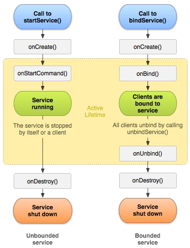

# Unit 3

## <mark> 1) What is SQLite? write a short note on it? </mark>

### **SQLite in Android**

**SQLite** is a **lightweight, relational database management system (RDBMS)** used in Android for **storing structured data locally** on the device. It is embedded within Android, meaning no **separate server** or configuration is required.

---

### **Features of SQLite**

1. **Lightweight & Embedded** – No external setup needed.
2. **ACID-Compliant** – Ensures data integrity with **Atomicity, Consistency, Isolation, and Durability**.
3. **Uses SQL Queries** – Supports **CRUD operations** (`CREATE`, `READ`, `UPDATE`, `DELETE`).
4. **Local Storage** – Stores data in a **single file on the device**.
5. **Efficient & Fast** – Works well for **small to medium-sized applications**.

---

### **Basic Example: Using SQLite in Android**

#### **1. Create a Database Helper Class (`DatabaseHelper.java`)**

```java
import android.content.Context;
import android.database.sqlite.SQLiteDatabase;
import android.database.sqlite.SQLiteOpenHelper;

public class DatabaseHelper extends SQLiteOpenHelper {
    private static final String DATABASE_NAME = "students.db";
    private static final int DATABASE_VERSION = 1;

    public DatabaseHelper(Context context) {
        super(context, DATABASE_NAME, null, DATABASE_VERSION);
    }

    @Override
    public void onCreate(SQLiteDatabase db) {
        String createTable = "CREATE TABLE students (id INTEGER PRIMARY KEY, name TEXT, age INTEGER)";
        db.execSQL(createTable);
    }

    @Override
    public void onUpgrade(SQLiteDatabase db, int oldVersion, int newVersion) {
        db.execSQL("DROP TABLE IF EXISTS students");
        onCreate(db);
    }
}
```

#### **2. Insert Data into SQLite**

```java
SQLiteDatabase db = new DatabaseHelper(this).getWritableDatabase();
ContentValues values = new ContentValues();
values.put("name", "John Doe");
values.put("age", 20);
db.insert("students", null, values);
db.close();
```

---

### **Use Cases of SQLite**

- **Offline Applications** – Stores data locally without internet.
- **User Data Storage** – Saves user preferences, settings, and history.
- **Small to Medium Databases** – Manages local data efficiently for mobile apps.

---

### **Conclusion**

SQLite is a **powerful and efficient local database** for Android applications. It is widely used for **storing structured data** without requiring an internet connection.

## <mark> 2) Explain the concept of Broadcast Receivers in detail. </mark>

### **Broadcast Receivers in Android**

A **Broadcast Receiver** in Android is a component that listens for **system-wide or app-specific broadcast messages**. These broadcasts notify apps about **system events or custom app events**, such as **battery status, network changes, SMS received, etc.**

---

### **Types of Broadcasts in Android**

1. **System Broadcasts** – Sent by the Android system when an event occurs.

   - Example: **Battery Low, Airplane Mode Changed, Wi-Fi Connected**
   - Intent Action: `Intent.ACTION_BATTERY_LOW`, `Intent.ACTION_BOOT_COMPLETED`

2. **Custom Broadcasts** – Sent by apps to communicate with other apps or components.
   - Example: A **music app** can broadcast an event when a song starts playing.
   - Sent using: `sendBroadcast()`

---

### **Implementing a Broadcast Receiver in Android**

#### **1. Create a Broadcast Receiver Class (`MyReceiver.java`)**

```java
import android.content.BroadcastReceiver;
import android.content.Context;
import android.content.Intent;
import android.widget.Toast;

public class MyReceiver extends BroadcastReceiver {
    @Override
    public void onReceive(Context context, Intent intent) {
        Toast.makeText(context, "Broadcast Received!", Toast.LENGTH_SHORT).show();
    }
}
```

---

#### **2. Register the Receiver in `AndroidManifest.xml` (Static Registration)**

```xml
<receiver android:name=".MyReceiver">
    <intent-filter>
        <action android:name="android.intent.action.BOOT_COMPLETED"/>
    </intent-filter>
</receiver>
```

---

#### **3. Register the Receiver Dynamically in Java (Dynamic Registration)**

```java
import android.content.IntentFilter;

MyReceiver myReceiver = new MyReceiver();
IntentFilter filter = new IntentFilter(Intent.ACTION_AIRPLANE_MODE_CHANGED);
registerReceiver(myReceiver, filter);
```

---

### **Sending a Custom Broadcast**

#### **1. Sending a Broadcast from an Activity**

```java
Intent intent = new Intent("com.example.CUSTOM_BROADCAST");
sendBroadcast(intent);
```

#### **2. Receiving the Custom Broadcast**

```xml
<receiver android:name=".MyReceiver">
    <intent-filter>
        <action android:name="com.example.CUSTOM_BROADCAST"/>
    </intent-filter>
</receiver>
```

---

### **Common Use Cases of Broadcast Receivers**

| Event                     | Intent Action                             |
| ------------------------- | ----------------------------------------- |
| **Battery Low**           | `Intent.ACTION_BATTERY_LOW`               |
| **Network Change**        | `ConnectivityManager.CONNECTIVITY_ACTION` |
| **Boot Completed**        | `Intent.ACTION_BOOT_COMPLETED`            |
| **Airplane Mode Changed** | `Intent.ACTION_AIRPLANE_MODE_CHANGED`     |

---

### **Conclusion**

Broadcast Receivers allow apps to **listen for system events or custom broadcasts**. They are useful for **handling background tasks, updating UI based on events, and enabling inter-app communication**.

## <mark> 3) What is Cursor? Explain methods of Cursor class. </mark>

### **Cursor in Android**

A **Cursor** in Android is an interface that provides **random read and write access** to the result set returned by a database query. It is used to **navigate through database records** retrieved from **SQLite**.

---

### **Key Features of Cursor**

1. **Allows Iteration** – Moves through rows in a result set.
2. **Provides Access to Columns** – Retrieves values using column indices.
3. **Optimized for Performance** – Handles large datasets efficiently.
4. **Supports Data Modification** – Can update and delete records.

---

### **Common Methods of Cursor Class**

| Method                              | Description                                               |
| ----------------------------------- | --------------------------------------------------------- |
| `moveToFirst()`                     | Moves cursor to the **first row**.                        |
| `moveToLast()`                      | Moves cursor to the **last row**.                         |
| `moveToNext()`                      | Moves cursor to the **next row**.                         |
| `moveToPrevious()`                  | Moves cursor to the **previous row**.                     |
| `getCount()`                        | Returns the **total number of rows** in the result set.   |
| `getColumnIndex(String columnName)` | Returns the **index of a column** by name.                |
| `getString(int columnIndex)`        | Retrieves a **String** value from a column.               |
| `getInt(int columnIndex)`           | Retrieves an **Integer** value from a column.             |
| `getDouble(int columnIndex)`        | Retrieves a **Double** value from a column.               |
| `isAfterLast()`                     | Returns `true` if the cursor is **after the last row**.   |
| `isBeforeFirst()`                   | Returns `true` if the cursor is **before the first row**. |
| `close()`                           | Closes the cursor to **release resources**.               |

---

### **Example: Using Cursor to Read Data from SQLite**

```java
import android.database.Cursor;
import android.database.sqlite.SQLiteDatabase;
import android.widget.Toast;

public void fetchData() {
    SQLiteDatabase db = new DatabaseHelper(this).getReadableDatabase();
    Cursor cursor = db.rawQuery("SELECT * FROM students", null);

    if (cursor.moveToFirst()) {  // Move to first record
        do {
            int id = cursor.getInt(cursor.getColumnIndex("id"));
            String name = cursor.getString(cursor.getColumnIndex("name"));
            int age = cursor.getInt(cursor.getColumnIndex("age"));

            Toast.makeText(this, "ID: " + id + ", Name: " + name + ", Age: " + age, Toast.LENGTH_SHORT).show();
        } while (cursor.moveToNext());  // Move to next record
    }

    cursor.close();  // Close cursor after use
    db.close();
}
```

---

### **Conclusion**

The **Cursor class** is essential for working with **SQLite databases** in Android. It provides **efficient data retrieval** methods and helps in **iterating, modifying, and accessing database records**.

## <mark> 4) Explain SQLite Open Helper with example. </mark>

### **SQLiteOpenHelper in Android**

`SQLiteOpenHelper` is an **abstract class** in Android that provides **an easy way to manage SQLite databases**. It helps in **creating, upgrading, and managing database versions** without writing complex SQL code manually.

---

### **Key Features of SQLiteOpenHelper**

1. **Manages Database Creation & Versioning** – Automatically handles **database creation and schema upgrades**.
2. **Efficient Database Access** – Uses **caching** to improve performance.
3. **Handles Migrations** – Upgrades or downgrades the database when the version changes.
4. **Prevents Memory Leaks** – Helps in managing **database connections efficiently**.

---

### **Steps to Implement SQLiteOpenHelper**

#### **1. Create a Database Helper Class (`DatabaseHelper.java`)**

```java
import android.content.Context;
import android.database.sqlite.SQLiteDatabase;
import android.database.sqlite.SQLiteOpenHelper;

public class DatabaseHelper extends SQLiteOpenHelper {

    // Database Name and Version
    private static final String DATABASE_NAME = "students.db";
    private static final int DATABASE_VERSION = 1;

    // Table Creation Query
    private static final String CREATE_TABLE =
        "CREATE TABLE students (id INTEGER PRIMARY KEY AUTOINCREMENT, name TEXT, age INTEGER)";

    public DatabaseHelper(Context context) {
        super(context, DATABASE_NAME, null, DATABASE_VERSION);
    }

    // Called when the database is created
    @Override
    public void onCreate(SQLiteDatabase db) {
        db.execSQL(CREATE_TABLE);
    }

    // Called when the database version is updated
    @Override
    public void onUpgrade(SQLiteDatabase db, int oldVersion, int newVersion) {
        db.execSQL("DROP TABLE IF EXISTS students"); // Remove old table
        onCreate(db); // Create new table
    }
}
```

---

#### **2. Insert Data into Database (`MainActivity.java`)**

```java
import android.content.ContentValues;
import android.database.sqlite.SQLiteDatabase;
import android.os.Bundle;
import android.widget.Toast;
import androidx.appcompat.app.AppCompatActivity;

public class MainActivity extends AppCompatActivity {
    @Override
    protected void onCreate(Bundle savedInstanceState) {
        super.onCreate(savedInstanceState);
        setContentView(R.layout.activity_main);

        DatabaseHelper dbHelper = new DatabaseHelper(this);
        SQLiteDatabase db = dbHelper.getWritableDatabase();

        ContentValues values = new ContentValues();
        values.put("name", "John Doe");
        values.put("age", 25);

        long result = db.insert("students", null, values);
        db.close();

        if (result != -1) {
            Toast.makeText(this, "Data Inserted Successfully!", Toast.LENGTH_SHORT).show();
        }
    }
}
```

---

### **Methods in SQLiteOpenHelper**

| Method                                                         | Description                                                 |
| -------------------------------------------------------------- | ----------------------------------------------------------- |
| `onCreate(SQLiteDatabase db)`                                  | Called **when the database is created** for the first time. |
| `onUpgrade(SQLiteDatabase db, int oldVersion, int newVersion)` | Called **when the database version is changed**.            |
| `getReadableDatabase()`                                        | Returns a **read-only** instance of the database.           |
| `getWritableDatabase()`                                        | Returns a **read/write** instance of the database.          |
| `close()`                                                      | Closes the database connection.                             |

---

### **Conclusion**

`SQLiteOpenHelper` **simplifies database management** by handling **creation, upgrades, and version control** automatically. It is widely used in **offline storage, user data management, and caching** in Android apps.

## <mark> 5) Explain Opening and Creating Databases with the SQLite Open Helper. </mark>

### **Opening and Creating Databases with SQLiteOpenHelper in Android**

In Android, **SQLiteOpenHelper** is used to **create, open, and manage SQLite databases** efficiently. It simplifies database handling by **automatically creating or upgrading the database** when needed.

---

### **Steps to Create and Open a Database Using SQLiteOpenHelper**

#### **1. Create a Database Helper Class (`DatabaseHelper.java`)**

This class extends `SQLiteOpenHelper` and **manages database creation and version control**.

```java
import android.content.Context;
import android.database.sqlite.SQLiteDatabase;
import android.database.sqlite.SQLiteOpenHelper;

public class DatabaseHelper extends SQLiteOpenHelper {

    // Database Name and Version
    private static final String DATABASE_NAME = "students.db";
    private static final int DATABASE_VERSION = 1;

    // Table Creation Query
    private static final String CREATE_TABLE =
        "CREATE TABLE students (id INTEGER PRIMARY KEY AUTOINCREMENT, name TEXT, age INTEGER)";

    public DatabaseHelper(Context context) {
        super(context, DATABASE_NAME, null, DATABASE_VERSION);
    }

    // Called when the database is created
    @Override
    public void onCreate(SQLiteDatabase db) {
        db.execSQL(CREATE_TABLE); // Execute SQL query to create table
    }

    // Called when the database version is updated
    @Override
    public void onUpgrade(SQLiteDatabase db, int oldVersion, int newVersion) {
        db.execSQL("DROP TABLE IF EXISTS students"); // Remove old table
        onCreate(db); // Create new table
    }
}
```

---

#### **2. Open or Create the Database in an Activity (`MainActivity.java`)**

To **open or create** a database, instantiate `DatabaseHelper`.

```java
import android.database.sqlite.SQLiteDatabase;
import android.os.Bundle;
import android.widget.Toast;
import androidx.appcompat.app.AppCompatActivity;

public class MainActivity extends AppCompatActivity {

    @Override
    protected void onCreate(Bundle savedInstanceState) {
        super.onCreate(savedInstanceState);
        setContentView(R.layout.activity_main);

        // Create or open the database
        DatabaseHelper dbHelper = new DatabaseHelper(this);
        SQLiteDatabase db = dbHelper.getWritableDatabase(); // Opens the database

        if (db != null) {
            Toast.makeText(this, "Database Opened Successfully!", Toast.LENGTH_SHORT).show();
        }
    }
}
```

---

### **Methods Used for Opening and Creating Databases**

| Method                                                         | Description                                                               |
| -------------------------------------------------------------- | ------------------------------------------------------------------------- |
| `getWritableDatabase()`                                        | Opens **read/write access** to the database (creates it if not existing). |
| `getReadableDatabase()`                                        | Opens the database in **read-only mode**.                                 |
| `onCreate(SQLiteDatabase db)`                                  | Called **once** when the database is first created.                       |
| `onUpgrade(SQLiteDatabase db, int oldVersion, int newVersion)` | Called when the **database version changes**, used for migrations.        |

---

### **Conclusion**

Using `SQLiteOpenHelper`, Android apps can **create, open, and manage SQLite databases** seamlessly. It ensures that databases are created only **once**, and provides methods to **handle upgrades automatically**, making it essential for **local data storage**.

## <mark> 6) Explain Opening and Creating Databases without the SQLite Open Helper. </mark>

### **Opening and Creating Databases Without SQLiteOpenHelper in Android**

In Android, **databases can be created and opened manually** using `SQLiteDatabase` instead of `SQLiteOpenHelper`. This approach gives more **control over database operations** but requires **manual handling** of database creation and versioning.

---

### **Steps to Open and Create a Database Without SQLiteOpenHelper**

#### **1. Create or Open a Database (`MainActivity.java`)**

We use `SQLiteDatabase.openOrCreateDatabase()` or `SQLiteDatabase.execSQL()` to create a database and table.

```java
import android.database.sqlite.SQLiteDatabase;
import android.os.Bundle;
import android.widget.Toast;
import androidx.appcompat.app.AppCompatActivity;

public class MainActivity extends AppCompatActivity {
    @Override
    protected void onCreate(Bundle savedInstanceState) {
        super.onCreate(savedInstanceState);
        setContentView(R.layout.activity_main);

        // Step 1: Open or Create the Database
        SQLiteDatabase db = openOrCreateDatabase("students.db", MODE_PRIVATE, null);

        // Step 2: Create a Table (if not exists)
        String createTableQuery = "CREATE TABLE IF NOT EXISTS students (id INTEGER PRIMARY KEY AUTOINCREMENT, name TEXT, age INTEGER)";
        db.execSQL(createTableQuery);

        Toast.makeText(this, "Database Created Successfully!", Toast.LENGTH_SHORT).show();

        // Close the database after use
        db.close();
    }
}
```

---

### **2. Insert Data into the Database**

Manually inserting data using `execSQL()`.

```java
// Open database
SQLiteDatabase db = openOrCreateDatabase("students.db", MODE_PRIVATE, null);

// Insert data
String insertQuery = "INSERT INTO students (name, age) VALUES ('John Doe', 25)";
db.execSQL(insertQuery);

// Close database
db.close();
```

---

### **3. Retrieve Data from the Database**

Using a `Cursor` to fetch data.

```java
// Open database
SQLiteDatabase db = openOrCreateDatabase("students.db", MODE_PRIVATE, null);

// Execute query
Cursor cursor = db.rawQuery("SELECT * FROM students", null);

if (cursor.moveToFirst()) {
    do {
        String name = cursor.getString(cursor.getColumnIndex("name"));
        int age = cursor.getInt(cursor.getColumnIndex("age"));
        Toast.makeText(this, "Name: " + name + ", Age: " + age, Toast.LENGTH_SHORT).show();
    } while (cursor.moveToNext());
}

// Close cursor and database
cursor.close();
db.close();
```

---

### **Methods Used for Manual Database Management**

| Method                                      | Description                                                         |
| ------------------------------------------- | ------------------------------------------------------------------- |
| `openOrCreateDatabase(name, mode, factory)` | Opens or **creates** a database if it doesn't exist.                |
| `execSQL(sqlQuery)`                         | Executes a **single SQL statement** (CREATE, INSERT, DELETE, etc.). |
| `rawQuery(sqlQuery, selectionArgs)`         | Executes a **SELECT query** and returns a `Cursor`.                 |
| `close()`                                   | Closes the database connection.                                     |

---

### **Comparison: With vs. Without SQLiteOpenHelper**

| Feature                   | Using SQLiteOpenHelper | Without SQLiteOpenHelper |
| ------------------------- | ---------------------- | ------------------------ |
| **Database Management**   | Automatic              | Manual                   |
| **Code Complexity**       | Less                   | More                     |
| **Handles Upgrades**      | Yes                    | No                       |
| **Ease of Use**           | Easier                 | Harder                   |
| **Control Over Database** | Limited                | Full Control             |

---

### **Conclusion**

Manually opening and creating databases **without SQLiteOpenHelper** provides **full control** but requires **more effort** for **handling versions, migrations, and optimizations**. It is suitable for **small projects or cases where full customization is needed**.

## <mark> 7) Explain how to Query, insert, update and delete rows from Database. </mark>

### **Query, Insert, Update, and Delete Rows in SQLite Database in Android**

In Android, we use **SQLiteDatabase** to perform **CRUD (Create, Read, Update, Delete) operations** on an SQLite database.

---

### **1. Inserting Data into Database**

#### **Using `insert()` Method (Recommended)**

```java
SQLiteDatabase db = new DatabaseHelper(this).getWritableDatabase();
ContentValues values = new ContentValues();
values.put("name", "John Doe");
values.put("age", 25);

long result = db.insert("students", null, values);
db.close();

if (result != -1) {
    Toast.makeText(this, "Data Inserted Successfully!", Toast.LENGTH_SHORT).show();
}
```

#### **Using `execSQL()` Method (Manual SQL Query Execution)**

```java
db.execSQL("INSERT INTO students (name, age) VALUES ('Alice', 22)");
```

---

### **2. Querying Data from Database**

#### **Using `rawQuery()` Method (Recommended for SELECT Queries)**

```java
SQLiteDatabase db = new DatabaseHelper(this).getReadableDatabase();
Cursor cursor = db.rawQuery("SELECT * FROM students", null);

if (cursor.moveToFirst()) {
    do {
        int id = cursor.getInt(cursor.getColumnIndex("id"));
        String name = cursor.getString(cursor.getColumnIndex("name"));
        int age = cursor.getInt(cursor.getColumnIndex("age"));

        Toast.makeText(this, "ID: " + id + ", Name: " + name + ", Age: " + age, Toast.LENGTH_SHORT).show();
    } while (cursor.moveToNext());
}

cursor.close();
db.close();
```

#### **Using `query()` Method (Safer and More Flexible)**

```java
Cursor cursor = db.query("students", new String[]{"id", "name", "age"}, null, null, null, null, null);
```

---

### **3. Updating Data in Database**

#### **Using `update()` Method (Recommended)**

```java
SQLiteDatabase db = new DatabaseHelper(this).getWritableDatabase();
ContentValues values = new ContentValues();
values.put("age", 30);  // Update age to 30

int rowsAffected = db.update("students", values, "name=?", new String[]{"John Doe"});
db.close();

if (rowsAffected > 0) {
    Toast.makeText(this, "Data Updated Successfully!", Toast.LENGTH_SHORT).show();
}
```

#### **Using `execSQL()` Method (Manual SQL Query Execution)**

```java
db.execSQL("UPDATE students SET age = 30 WHERE name = 'Alice'");
```

---

### **4. Deleting Data from Database**

#### **Using `delete()` Method (Recommended)**

```java
SQLiteDatabase db = new DatabaseHelper(this).getWritableDatabase();
int rowsDeleted = db.delete("students", "name=?", new String[]{"John Doe"});
db.close();

if (rowsDeleted > 0) {
    Toast.makeText(this, "Data Deleted Successfully!", Toast.LENGTH_SHORT).show();
}
```

#### **Using `execSQL()` Method (Manual SQL Query Execution)**

```java
db.execSQL("DELETE FROM students WHERE name = 'Alice'");
```

---

### **Comparison of Methods**

| Operation  | Recommended Method        | Alternative Method           |
| ---------- | ------------------------- | ---------------------------- |
| **Insert** | `insert()`                | `execSQL("INSERT INTO ...")` |
| **Query**  | `query()` or `rawQuery()` | `execSQL("SELECT ...")`      |
| **Update** | `update()`                | `execSQL("UPDATE ...")`      |
| **Delete** | `delete()`                | `execSQL("DELETE ...")`      |

---

### **Conclusion**

- **`insert()`, `query()`, `update()`, and `delete()`** methods are preferred because they provide **better security and flexibility**.
- **`execSQL()`** is useful for complex operations but should be used cautiously.
- Always **close the database and cursor** after operations to prevent **memory leaks**.

## <mark> 8) What is service? Explain Service Life Cycle. </mark>

### **What is a Service in Android?**

A **Service** in Android is a **background component** that runs **without a user interface (UI)**. It is used for **long-running operations** such as **playing music, downloading files, or processing data** in the background.

---

### **Types of Services in Android**

1. **Foreground Service** – Runs in the background but **shows a notification** (e.g., music player).
2. **Background Service** – Runs **without user interaction** (e.g., syncing data).
3. **Bound Service** – Allows **other components (Activities/Fragments) to bind** and interact with the service.

---

### **Service Lifecycle in Android**

A service has **three main states** and follows a **specific lifecycle**.

#### **Service Lifecycle Methods**

| Method             | Description                                                                                     |
| ------------------ | ----------------------------------------------------------------------------------------------- |
| `onCreate()`       | Called **when the service is first created**. Used for initialization.                          |
| `onStartCommand()` | Called **when the service is started** using `startService()`. Handles tasks in the background. |
| `onBind()`         | Called **when a component binds** to a bound service using `bindService()`.                     |
| `onUnbind()`       | Called **when all clients unbind** from a bound service.                                        |
| `onDestroy()`      | Called **when the service is stopped**. Used for cleanup.                                       |

---

### **Service Lifecycle Diagram**



---

### **Example: Creating a Simple Service in Android**

#### **1. Create a Service Class (`MyService.java`)**

```java
import android.app.Service;
import android.content.Intent;
import android.os.IBinder;
import android.widget.Toast;

public class MyService extends Service {
    @Override
    public void onCreate() {
        super.onCreate();
        Toast.makeText(this, "Service Created", Toast.LENGTH_SHORT).show();
    }

    @Override
    public int onStartCommand(Intent intent, int flags, int startId) {
        Toast.makeText(this, "Service Started", Toast.LENGTH_SHORT).show();
        return START_STICKY; // Keeps the service running if killed
    }

    @Override
    public void onDestroy() {
        super.onDestroy();
        Toast.makeText(this, "Service Stopped", Toast.LENGTH_SHORT).show();
    }

    @Override
    public IBinder onBind(Intent intent) {
        return null; // Not a bound service
    }
}
```

---

#### **2. Register the Service in `AndroidManifest.xml`**

```xml
<service android:name=".MyService" />
```

---

#### **3. Start and Stop the Service from an Activity**

```java
// Start Service
Intent intent = new Intent(this, MyService.class);
startService(intent);

// Stop Service
stopService(intent);
```

---

### **Conclusion**

A **Service** is used for **background tasks** in Android without UI. The **Service Lifecycle** is managed using methods like `onCreate()`, `onStartCommand()`, and `onDestroy()`. Services are useful for **long-running operations like music playback, downloading, and background processing**.

## <mark> 9) Explain Type of Services in android. </mark>
